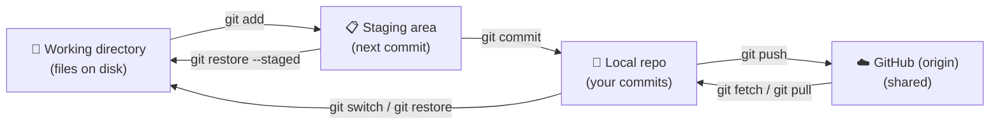
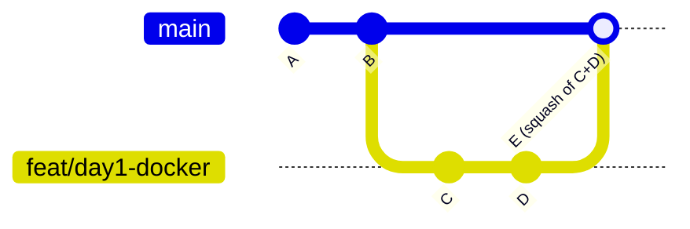
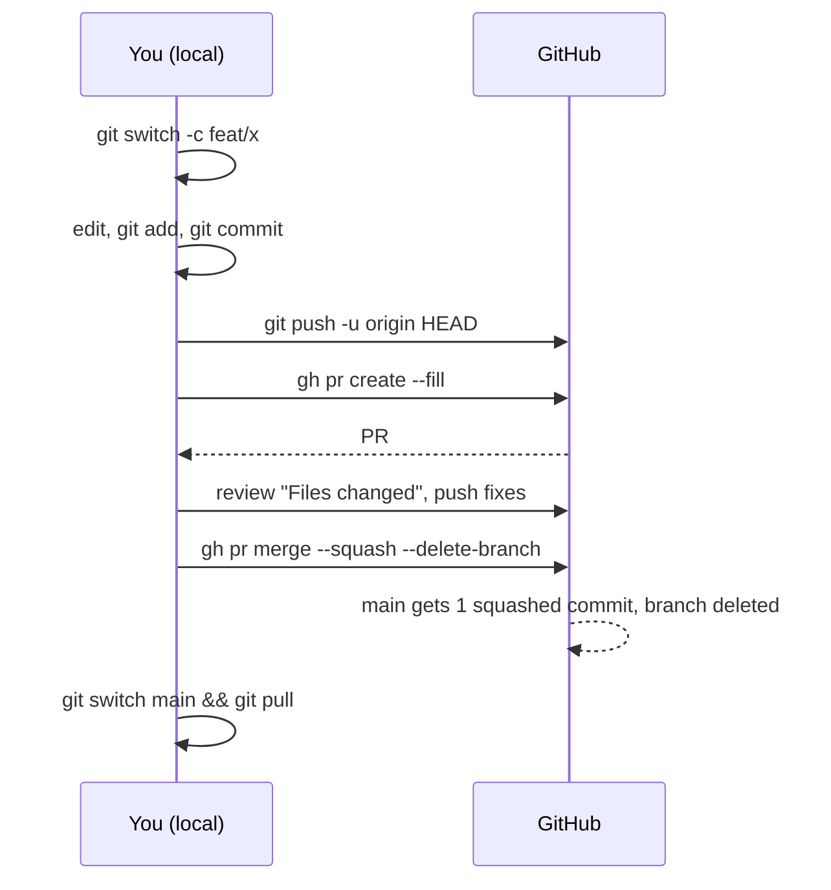
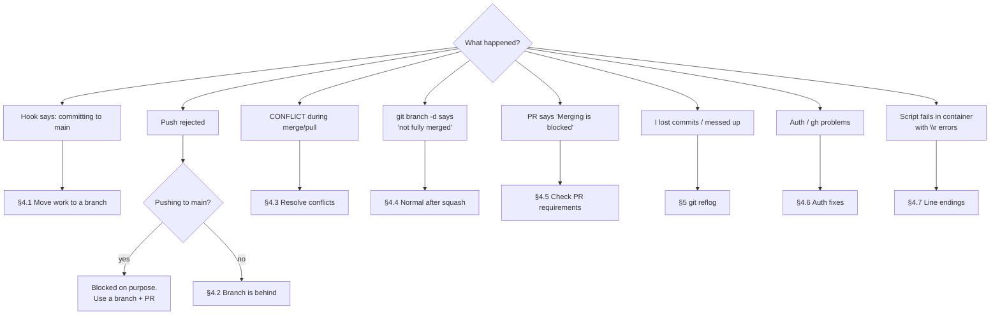
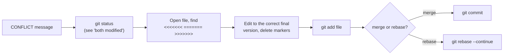
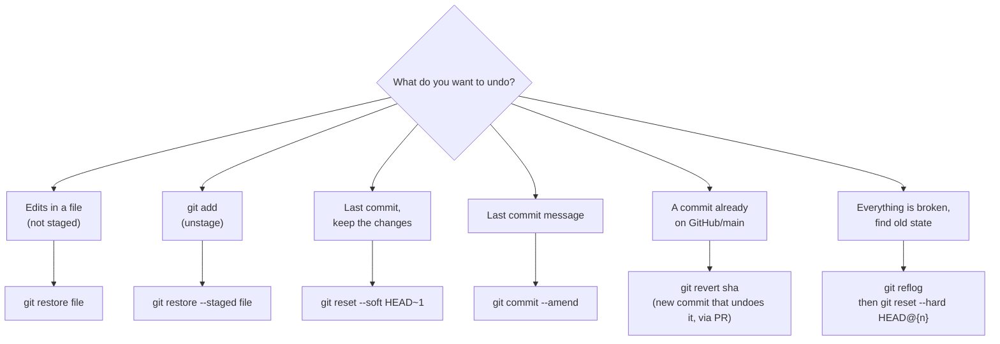

# Git & GitHub Cheatsheet

Diagrams render on GitHub, and in VS Code with a Mermaid preview extension.

- [1. The mental model](#1-the-mental-model)
- [2. Daily commands](#2-daily-commands)
- [3. GitHub CLI (`gh`)](#3-github-cli-gh)
- [4. Troubleshooting: "something went wrong"](#4-troubleshooting)
- [5. Undo anything](#5-undo-anything)

---

## 1. The mental model

Git has **four places** a change can live. Most confusion comes from not knowing which one
you're in.



`git status` always tells you which area each file is in. **Run it constantly.**

### Branches are just pointers



`main` and `feat/day1-docker` are labels pointing at commits. `HEAD` is "where you are now".

---

## 2. Daily commands

### Status & inspection

| Command | What it does |
| --- | --- |
| `git status` | What's changed / staged / which branch am I on |
| `git status -sb` | Short version + ahead/behind count |
| `git diff` | Unstaged changes |
| `git diff --staged` | What will go into the next commit |
| `git log --oneline --graph --all -20` | Visual history of all branches |
| `git branch -vv` | Local branches + what they track + ahead/behind |
| `git show <sha>` | One commit in detail |

### Branching

| Command | What it does |
| --- | --- |
| `git switch main` | Go to main |
| `git switch -c feat/x` | Create **and** switch to a new branch |
| `git branch` | List local branches (`*` = current) |
| `git branch -d feat/x` | Delete a merged branch |
| `git branch -D feat/x` | Force-delete (needed after **squash** merges, see §4) |

### Committing

| Command | What it does |
| --- | --- |
| `git add <file>` | Stage one file |
| `git add -p` | Stage hunk by hunk (review as you go) |
| `git commit -m "type: summary"` | Commit staged changes |
| `git commit --amend` | Fix the last commit (message or content). **Only before pushing**, or on your own branch with force-with-lease |

### Syncing

| Command | What it does |
| --- | --- |
| `git pull` | Fetch + update current branch |
| `git fetch --prune` | Download remote state and forget deleted remote branches |
| `git push -u origin HEAD` | First push of a new branch |
| `git push` | Later pushes |
| `git push --force-with-lease` | Overwrite **your own** branch after rebase/amend (safe force) |
| `git merge origin/main` | Bring latest main into your branch |

### Stash (park work temporarily)

```powershell
git stash push -m "half-done compose file"   # park it
git stash list                               # see what's parked
git stash pop                                # bring it back
```

---

## 3. GitHub CLI (`gh`)

| Command | What it does |
| --- | --- |
| `gh auth status` | Am I logged in? |
| `gh pr create --fill` | Open a PR from the current branch |
| `gh pr create --draft --fill` | Open a draft PR (work in progress) |
| `gh pr status` | PRs relevant to you |
| `gh pr view --web` | Open the current branch's PR in the browser |
| `gh pr diff` | See the PR diff in the terminal |
| `gh pr checks` | CI status of the PR |
| `gh pr merge --squash --delete-branch` | Merge the PR |
| `gh pr list` | Open PRs |
| `gh pr checkout <number>` | Check out someone's PR locally |
| `gh repo view --web` | Open the repo in the browser |
| `gh issue create` / `gh issue list` | Track TODOs as issues |

### Lifecycle of a PR



---

## 4. Troubleshooting

Start here and follow the arrow:



### 4.1 "ERROR: You are committing directly to 'main'"

Your changes are safe; the commit just didn't happen. Move to a branch, and **staged and
unstaged changes come with you**:

```powershell
git switch -c feat/my-topic
git commit -m "feat: ..."
```

**Already committed on main** (e.g. hooks were off)? The branch takes the commit with it,
then reset main back to GitHub's version:

```powershell
git branch feat/my-topic            # new branch pointing at your commit(s)
git reset --hard origin/main        # main back to GitHub's version
git switch feat/my-topic            # continue here
```

### 4.2 Push rejected: "Updates were rejected because the remote contains work..."

Your branch on GitHub has commits you don't have locally (e.g. you edited on github.com).

```powershell
git pull                 # merge remote changes into your branch
git push
```

**Your branch is behind `main`** (main moved since you branched):

```powershell
git fetch
git merge origin/main    # simple and safe; or: git rebase origin/main
git push                 # after rebase: git push --force-with-lease
```

### 4.3 Merge conflicts



Panic button: `git merge --abort` or `git rebase --abort` returns you to before you started.
VS Code shows **Accept Current / Accept Incoming / Accept Both** buttons above each conflict.

### 4.4 `git branch -d` says "not fully merged"

**Normal with squash merges.** GitHub created a *new* commit on main, so git doesn't recognise
your branch's commits as merged. Confirm the PR shows **Merged**, then:

```powershell
git branch -D feat/my-topic
```

### 4.5 PR says "Merging is blocked"

The `protect-main` ruleset requires:
- the change to come through a PR (✓ if you're looking at a PR)
- **all review conversations resolved**: click *Resolve conversation* on each comment
- linear history: use **Squash and merge** (the only button enabled)

If GitHub says the branch is out of date, click **Update branch** or do §4.2.

### 4.6 Auth / `gh` problems

| Symptom | Fix |
| --- | --- |
| `gh: command not found` / not recognized | Open a **new** terminal (PATH refresh). Full path: `"C:\Program Files\GitHub CLI\gh.exe"` |
| `You are not logged into any GitHub hosts` | `gh auth login` → GitHub.com → HTTPS → browser |
| git push asks for password / 403 | `gh auth setup-git` |
| Commits not linked to your profile | `git config user.email` must match an email on your GitHub account |

### 4.7 `\r: command not found` / `bad interpreter` inside a container

The file has Windows (CRLF) line endings. `.gitattributes` forces LF on commit, but files
created before it existed may still be CRLF:

```powershell
git add --renormalize .
git commit -m "chore: normalize line endings"
```

Also set VS Code's status bar line-ending selector to **LF** for `.sh`, `Dockerfile`, `.yaml`.

### 4.8 Other common ones

| Symptom | Fix |
| --- | --- |
| `fatal: not a git repository` | You're in the wrong folder: `cd` into the repo |
| `HEAD detached at ...` | `git switch main` (or `git switch -c new-branch` to keep work) |
| `Your local changes would be overwritten by checkout` | `git stash`, switch, `git stash pop`, or commit first |
| `fatal: refusing to merge unrelated histories` | You created the GitHub repo *with* a README. Usually start over; or `git pull origin main --allow-unrelated-histories` |
| `warning: LF will be replaced by CRLF` (or vice versa) | Expected, because `.gitattributes` is doing its job |
| Committed a file that should be ignored | Add to `.gitignore`, then `git rm --cached <file>` and commit |
| Hooks not running on a fresh clone | `git config core.hooksPath .githooks` |
| `git pull` says "divergent branches" | On main: `git reset --hard origin/main` (main should never have local-only commits). On a branch: `git pull --no-rebase` |

### 4.9 🚨 Committed a secret (password, token, kubeconfig)

1. **Rotate/revoke the secret first.** Assume it's compromised the moment it hit GitHub.
2. Remove the file and add it to `.gitignore`.
3. Deleting it in a new commit doesn't erase history. For a full scrub, use
   [`git filter-repo`](https://github.com/newren/git-filter-repo), but rotating is what actually
   protects you.

---

## 5. Undo anything



| Command | Destroys work? |
| --- | --- |
| `git restore <file>` | ⚠️ Yes, discards unstaged edits |
| `git restore --staged <file>` | No |
| `git reset --soft HEAD~1` | No, changes go back to staged |
| `git reset --hard <ref>` | ⚠️ Yes, discards uncommitted work |
| `git revert <sha>` | No, adds a new undo commit (safe for shared history) |
| `git reflog` | No. It's the safety net: lists every place `HEAD` has been for ~90 days |

> **Rule of thumb:** Local and not pushed → `reset`/`amend` freely. Already on `main` → `revert`.
