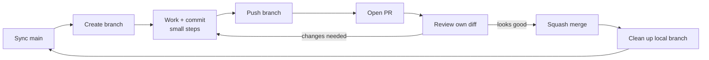
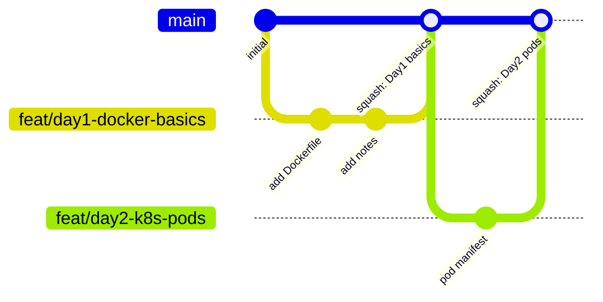

# Working in This Repo

The rule is simple: **`main` is never touched directly.** Every change, however small, goes
**branch → commit → push → Pull Request → merge**. Real teams work this way, and this repo
enforces it in two places:

| Guard | Where | What it blocks |
| --- | --- | --- |
| `pre-commit` hook | your laptop (`.githooks/`) | committing while on `main` |
| `pre-push` hook | your laptop (`.githooks/`) | `git push` to `main` |
| Branch ruleset `protect-main` | GitHub | direct pushes, force-pushes and deleting `main`; merging without a PR or with unresolved review comments |

Merges are **squash only**, so each PR becomes exactly one commit on `main` and history stays
clean and linear. The branch is deleted on GitHub automatically after the merge.

---

## The loop at a glance





---

## Step by step (every session)

### 0. One-time setup on a new machine / fresh clone

```powershell
git clone https://github.com/hrishikesh26/docker-kube-handson.git
cd docker-kube-handson
git config core.hooksPath .githooks     # turn on the local guards
python -m venv .venv
.\.venv\Scripts\Activate.ps1
pip install -r requirements.txt
```

### 1. Start from an up-to-date `main`

```powershell
git switch main
git pull                     # fast-forward to what's on GitHub
```

### 2. Create a branch for *one* topic

```powershell
git switch -c feat/day2-k8s-pods
```

### 3. Work and commit in small steps

```powershell
git status                   # what changed?
git diff                     # read the change before staging it
git add Day2/pod.yaml        # stage specific files (avoid blind `git add .`)
git commit -m "feat: add nginx pod manifest"
```

Commit early, commit often. Each commit should do one thing you could describe in one line.

### 4. Push the branch

```powershell
git push -u origin HEAD      # first push; afterwards just `git push`
```

### 5. Open a Pull Request

```powershell
gh pr create --fill          # title/body from your commits; template auto-fills
gh pr view --web             # open it in the browser
```

Fill in the PR template. Then open the **Files changed** tab and review your own diff the way
a teammate would. Most mistakes get caught right here.

### 6. Merge

```powershell
gh pr merge --squash --delete-branch
```

### 7. Clean up and go back to step 1

```powershell
git switch main
git pull
git branch -d feat/day2-k8s-pods      # if --delete-branch didn't already remove it
git fetch --prune                     # forget remote branches deleted on GitHub
```

---

## Naming conventions

### Branches: `<type>/<short-description>`

| Type | Use for | Example |
| --- | --- | --- |
| `feat/` | new practice content / new app | `feat/day3-deployments` |
| `fix/` | fixing something broken | `fix/dockerfile-port` |
| `docs/` | notes, README, cheatsheets | `docs/k8s-networking-notes` |
| `chore/` | tooling, config, cleanup | `chore/update-gitignore` |
| `refactor/` | restructuring without changing behaviour | `refactor/split-compose-files` |

Lowercase, hyphens, no spaces. Name it after the **topic**, not the date alone.

### Commits: [Conventional Commits](https://www.conventionalcommits.org/)

```text
<type>: <imperative summary, ≤ 72 chars>

<optional body: why, not what>
```

Good: `feat: add multi-stage Dockerfile for flask app`
Bad: `updated stuff`, `WIP`, `final final v2`

---

## Golden rules

1. **Never commit on `main`.** If you did by accident, see the cheatsheet: *"I committed on main"*.
2. **One branch = one topic = one PR.** Don't mix Day 2 and Day 3 work.
3. **Pull before you branch.** Old `main` → merge conflicts later.
4. **Never commit secrets.** `.env`, keys, kubeconfigs are ignored, so keep it that way. If one
   slips in, rotate the secret: deleting the file doesn't remove it from history.
5. **Read your diff before every commit and every merge.**
6. **Don't force-push shared branches.** On your own feature branch it's fine with
   `--force-with-lease`. On `main` it's blocked anyway.

See also: [GIT_CHEATSHEET.md](GIT_CHEATSHEET.md) for commands and troubleshooting.
